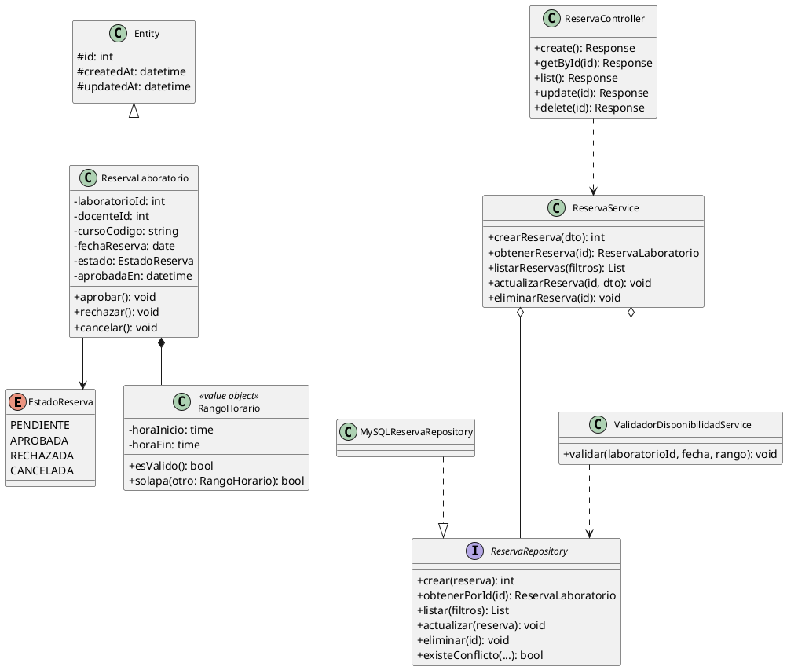
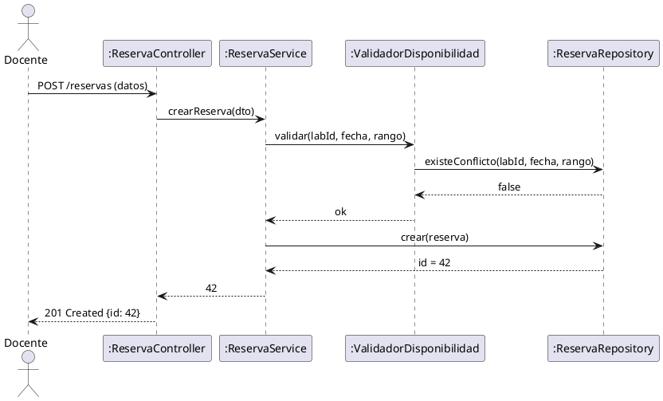
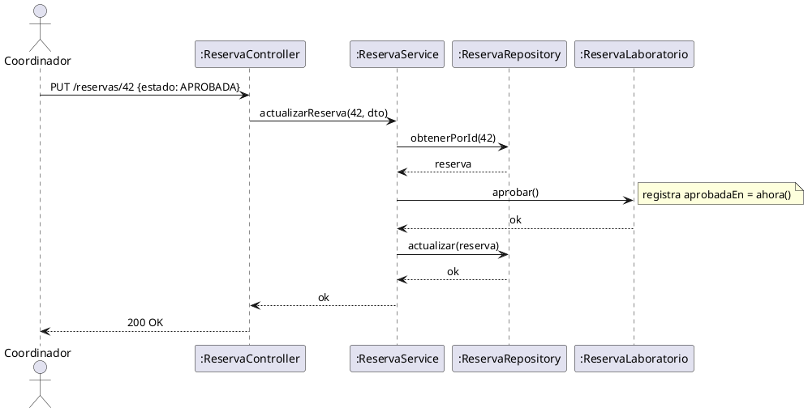

# Caso de Estudio POO: Sistema de Reservas de Laboratorio

**Asignatura:** Programación Orientada a Objetos
**Nivel:** Intermedio — Arquitectura en capas con Flask y MySQL
**Entregable:** Análisis, modelado UML y diseño del sistema

---

## Objetivo

Desarrollar un sistema de gestión de reservas de laboratorios universitarios aplicando los principios y técnicas de Programación Orientada a Objetos (POO), desde el enunciado del problema hasta el diseño completo con UML, como base para una implementación con API REST en Flask y MySQL sin ORM.

---

## 1. Enunciado del Problema

### 1.1 Contexto General

La Universidad Estatal de Milagro (UNEMI) cuenta con varios laboratorios de cómputo distribuidos en diferentes bloques del campus. Estos laboratorios son utilizados por docentes de diversas carreras para dictar clases prácticas, talleres y evaluaciones que requieren el uso de equipos informáticos especializados.

Actualmente, el proceso de reserva de laboratorios se realiza de manera manual: el docente llena un formulario físico, lo entrega a la coordinación académica, y el coordinador verifica manualmente la disponibilidad en una hoja de cálculo compartida. Este proceso genera múltiples problemas:

- **Conflictos de horario no detectados a tiempo:** dos docentes han llegado a presentarse simultáneamente al mismo laboratorio porque la hoja de cálculo no se actualizó correctamente.
- **Falta de trazabilidad:** no existe registro confiable de quién aprobó una reserva, cuándo fue aprobada ni por qué fue rechazada.
- **Proceso lento:** el docente debe esperar respuesta manual del coordinador, lo que puede tardar uno o dos días hábiles.
- **Inconsistencias de datos:** reservas canceladas que siguen apareciendo como activas, o reservas activas que nadie recuerda haber aprobado.

La coordinación académica ha decidido digitalizar este proceso a través de una **API REST** que centralice la gestión de reservas, aplique las reglas de negocio automáticamente y garantice la integridad de los datos.

---

### 1.2 Descripción del Sistema a Desarrollar

Se debe diseñar e implementar el módulo de **Gestión de Reservas de Laboratorio**, que permita a los docentes solicitar el uso de un laboratorio para una fecha y bloque horario específicos, y a los coordinadores académicos gestionar (aprobar, rechazar o cancelar) dichas solicitudes.

El sistema debe cumplir con las siguientes condiciones de negocio, que el estudiante debe identificar como **invariantes del dominio**:

**Reglas sobre el tiempo:**
- Una reserva no puede realizarse para una fecha anterior al día actual. El pasado no puede reservarse.
- El bloque horario debe ser válido: la hora de inicio debe ser estrictamente menor que la hora de fin. No se permiten bloques de duración cero ni negativos.
- El bloque mínimo de reserva es de 1 hora. El bloque máximo es de 4 horas consecutivas por reserva.

**Reglas sobre disponibilidad:**
- No puede existir más de una reserva activa (no cancelada, no rechazada) para el mismo laboratorio, en la misma fecha y en un bloque horario que se solape con otro ya existente. Dos bloques se solapan si uno comienza antes de que el otro termine.
- Al crear o modificar una reserva, el sistema debe verificar automáticamente la disponibilidad antes de confirmar la operación.

**Reglas sobre el ciclo de vida:**
- Toda reserva inicia en estado `PENDIENTE` al ser creada por el docente.
- Solo el coordinador puede cambiar el estado a `APROBADA` o `RECHAZADA`.
- El docente puede cancelar su propia reserva, siempre que aún esté en estado `PENDIENTE`.
- Una reserva `APROBADA` solo puede pasar a `CANCELADA`, no puede volver a `PENDIENTE` ni a `RECHAZADA`.
- Cuando una reserva es `APROBADA`, el sistema debe registrar automáticamente la fecha y hora exacta en que ocurrió la aprobación.

**Reglas sobre persistencia:**
- Los registros nunca se eliminan físicamente de la base de datos. El borrado es **lógico**: se marca una fecha de eliminación, pero el registro se mantiene para auditoría.
- Toda reserva debe tener registrada su fecha de creación y su fecha de última modificación.

---

### 1.3 Actores del Sistema

| Actor        | Descripción                                                                                       |
|--------------|---------------------------------------------------------------------------------------------------|
| **Docente**  | Solicita reservas de laboratorio para sus clases. Puede cancelar sus propias reservas pendientes. |
| **Coordinador** | Revisa las solicitudes pendientes. Puede aprobar o rechazar reservas. Consulta el historial. |
| **Sistema**  | Actor técnico. Valida reglas de negocio, detecta conflictos y gestiona el ciclo de vida automáticamente. |

---

### 1.4 Escenarios de Uso

**Escenario 1 — Reserva exitosa:**
La docente Ana García necesita el Laboratorio A el martes 10 de junio de 2026 de 08:00 a 10:00 para dictar la clase práctica de INF-202. Ingresa la solicitud al sistema. El sistema verifica que la fecha no es pasada, que el bloque es válido y que no existe ninguna reserva activa en ese laboratorio para ese horario. La solicitud se crea en estado `PENDIENTE`. El coordinador revisa y la aprueba; el sistema registra la aprobación con fecha y hora exactas. La reserva queda en estado `APROBADA`.

**Escenario 2 — Conflicto de horario:**
El docente Luis Romero intenta reservar el mismo Laboratorio A para el 10 de junio de 2026 de 09:00 a 11:00. El sistema detecta que ese bloque se solapa con la reserva ya existente de Ana García (08:00–10:00), ya que 09:00 < 10:00 y 11:00 > 08:00. El sistema rechaza la operación con un mensaje claro de conflicto. Luis debe elegir otro laboratorio u otro horario.

**Escenario 3 — Cancelación por el docente:**
Ana García decide que no necesita el laboratorio y cancela su reserva antes de que sea atendida. Como la reserva está en estado `PENDIENTE`, el sistema permite la cancelación. La reserva pasa a `CANCELADA`. A partir de ese momento, el horario queda disponible para otras reservas.

**Escenario 4 — Reserva en el pasado:**
Un docente intenta crear una reserva para ayer por error. El sistema detecta que la fecha es anterior a la fecha actual y rechaza la operación inmediatamente, sin consultar disponibilidad.

**Escenario 5 — Borrado lógico:**
El coordinador elimina una reserva errónea del sistema. El registro no desaparece de la base de datos: se marca con la fecha de eliminación. Cualquier consulta normal filtra los registros con esa marca y no los muestra, pero el área de auditoría puede consultarlos.

---

---

## 2. Análisis de Requerimientos

### 2.1 Requerimientos Funcionales

| ID    | Descripción                                                         |
|-------|---------------------------------------------------------------------|
| RF-01 | Crear una reserva de laboratorio                                    |
| RF-02 | Obtener una reserva por identificador                               |
| RF-03 | Listar reservas con filtros (estado, fecha, laboratorio)            |
| RF-04 | Actualizar reserva (datos, bloque horario, estado)                  |
| RF-05 | Eliminar reserva mediante borrado lógico                            |
| RF-06 | Validar conflictos de horario antes de crear o actualizar           |

### 2.2 Requerimientos No Funcionales

| ID     | Descripción                                         |
|--------|-----------------------------------------------------|
| RNF-01 | API REST con respuestas en formato JSON             |
| RNF-02 | Arquitectura en capas (dominio, aplicación, infra)  |
| RNF-03 | Sin ORM — SQL parametrizado con mysqlclient          |
| RNF-04 | Pool de conexiones MySQL                            |
| RNF-05 | Manejo de errores consistente y centralizado        |

### 2.3 Casos de Uso Principales

| CU    | Nombre                          | Actor       |
|-------|---------------------------------|-------------|
| CU-01 | Registrar reserva               | Docente     |
| CU-02 | Aprobar reserva                 | Coordinador |
| CU-03 | Consultar reservas por estado   | Coordinador |
| CU-04 | Cancelar reserva                | Docente     |

---

## 3. Proceso de Abstracción

### 3.1 Identificación de Conceptos del Dominio

| Concepto                        | Tipo                   | Responsabilidad                                              |
|---------------------------------|------------------------|--------------------------------------------------------------|
| `ReservaLaboratorio`            | Entidad de dominio     | Concentra reglas de negocio e invariantes                    |
| `RangoHorario`                  | Objeto de valor        | Representa el bloque de tiempo; inmutable                    |
| `EstadoReserva`                 | Enumeración            | Define los estados válidos del ciclo de vida                 |
| `ValidadorDisponibilidadService`| Servicio de dominio    | Valida que no existan conflictos de horario                  |
| `ReservaRepository`             | Interfaz (contrato)    | Desacopla dominio de persistencia                            |
| `MySQLReservaRepository`        | Implementación         | Implementa el repositorio sobre MySQL                        |
| `ReservaDAO`                    | Objeto de acceso       | Centraliza SQL, mapeo y manejo de conexiones                 |
| `ConnectionPool`                | Infraestructura        | Gestiona el pool de conexiones a MySQL                       |
| `ReservaService`                | Aplicación             | Orquesta casos de uso coordinando dominio e infraestructura  |
| `ReservaController`             | Interfaz REST          | Recibe peticiones HTTP y delega al servicio                  |

### 3.2 Aplicación de Técnicas POO

1. **Encapsulamiento**
   La entidad `ReservaLaboratorio` controla sus propios cambios de estado: `aprobar()`, `cancelar()`, `actualizarHorario()`. El estado nunca se modifica desde afuera directamente.

2. **Abstracción**
   `ReservaRepository` es una interfaz abstracta. El servicio de aplicación no conoce cómo se implementa la persistencia.

3. **Herencia**
   Se define una clase base `Entity` con los atributos comunes: `id`, `created_at`, `updated_at`. `ReservaLaboratorio` hereda de ella.

4. **Polimorfismo**
   `ReservaRepository` permite intercambiar implementaciones: `MySQLReservaRepository` en producción, un repositorio en memoria para pruebas unitarias.

5. **Composición**
   `ReservaLaboratorio` compone `RangoHorario`. El rango no tiene sentido fuera del contexto de la reserva.

6. **Agregación**
   `ReservaService` agrega `ReservaRepository` y `ValidadorDisponibilidadService` por inyección de dependencias.

7. **Asociación**
   `ReservaLaboratorio` se asocia con `Laboratorio` y `Docente` a través de identificadores (FK conceptual).

8. **Dependencia**
   Los controladores dependen del servicio de aplicación, nunca del DAO directamente.

### 3.3 Invariantes de Dominio

| Regla                                              | Alcance          |
|----------------------------------------------------|------------------|
| `fecha_reserva >= hoy`                             | Al crear         |
| `hora_inicio < hora_fin`                           | Siempre          |
| `estado` ∈ {PENDIENTE, APROBADA, RECHAZADA, CANCELADA} | Siempre     |
| Si `estado = APROBADA` → `aprobada_en` ≠ nulo      | Al aprobar       |
| No existe otra reserva en el mismo lab, fecha y bloque | Al crear/actualizar |

---

## 4. Relaciones entre Entidades (POO)

| Relación             | Clases involucradas                                         | Descripción                                                           |
|----------------------|-------------------------------------------------------------|-----------------------------------------------------------------------|
| Herencia             | `Entity` ← `ReservaLaboratorio`                             | La entidad principal hereda atributos de trazabilidad                |
| Composición          | `ReservaLaboratorio` ◆── `RangoHorario`                     | El rango horario no existe sin la reserva                            |
| Implementación       | `ReservaRepository` ◁── `MySQLReservaRepository`            | El repositorio MySQL implementa el contrato de la interfaz            |
| Asociación           | `MySQLReservaRepository` ──► `ReservaDAO`                   | El repositorio usa el DAO para ejecutar SQL                           |
| Asociación           | `ReservaDAO` ──► `ConnectionPool`                           | El DAO obtiene conexiones del pool                                    |
| Agregación           | `ReservaService` ◇── `ReservaRepository`                   | El servicio usa el repositorio, pero no lo posee                      |
| Agregación           | `ReservaService` ◇── `ValidadorDisponibilidadService`       | El servicio agrega el validador por inyección                         |
| Dependencia          | `ReservaController` ──► `ReservaService`                    | El controlador usa el servicio solo para delegar peticiones           |

---

## 5. Modelado UML de Clases

### 5.1 Diagrama de Clases

### 5.2 Lectura Didáctica del Diagrama

| Observación                              | Principio POO              |
|------------------------------------------|----------------------------|
| `ReservaLaboratorio` concentra reglas    | Encapsulamiento            |
| `ReservaRepository` es interfaz          | Abstracción / Polimorfismo |
| `RangoHorario` es inmutable              | Objeto de valor            |
| `ReservaService` recibe dependencias     | Inyección de dependencias  |
| `ReservaController` no toca el DAO       | Separación de capas        |

---

## 6. Modelado UML de Secuencia

### 6.1 Secuencia: Crear Reserva

### 6.2 Secuencia: Aprobar Reserva

---

## 7. Checklist de Aprendizaje

- [ ] Identificar las entidades, objetos de valor y servicios de dominio del sistema.
- [ ] Diferenciar composición, agregación, asociación y dependencia en el diagrama.
- [ ] Explicar por qué se usa una interfaz de repositorio y qué ventaja aporta.
- [ ] Justificar la elección de SQL parametrizado en lugar de un ORM.
- [ ] Describir qué invariante del dominio impide crear reservas en el pasado.
- [ ] Proponer una regla de negocio adicional (ejemplo: máximo 4 horas por docente por día).

---

## 8. Extensiones Sugeridas

> Las tablas `laboratorios` y `docentes` ya están definidas en el archivo [02-modelado-clases-vs-tablas-fisicas.md](02-modelado-clases-vs-tablas-fisicas.md). Las extensiones siguientes van más allá del alcance del laboratorio base.

- Validar la capacidad del laboratorio al crear una reserva (usando `laboratorios.capacidad`).
- Tabla `reservas_eventos` para auditoría de cambios de estado (Event Sourcing básico).
- Paginación y ordenamiento configurable en el listado de reservas.
- Tests unitarios con repositorio en memoria (sin base de datos real).
- Tests de integración con MySQL en Docker.
- Patrón Unit of Work para agrupar múltiples operaciones en una sola transacción.

---

## 9. Conclusiones Didácticas

Este caso de estudio permite practicar POO de forma integral:

| Etapa                        | Actividad                                         |
|------------------------------|---------------------------------------------------|
| Enunciado → Abstracción       | Identificar entidades, relaciones e invariantes  |
| Abstracción → UML             | Modelar clases, relaciones y secuencias          |
| UML → Código                 | Implementar capas desacopladas en Python/Flask   |
| Código → Comportamiento       | Observar el sistema via API REST                 |

La clave pedagógica es que POO no es simplemente "usar clases", sino modelar correctamente responsabilidades, relaciones e invariantes del dominio de negocio.
